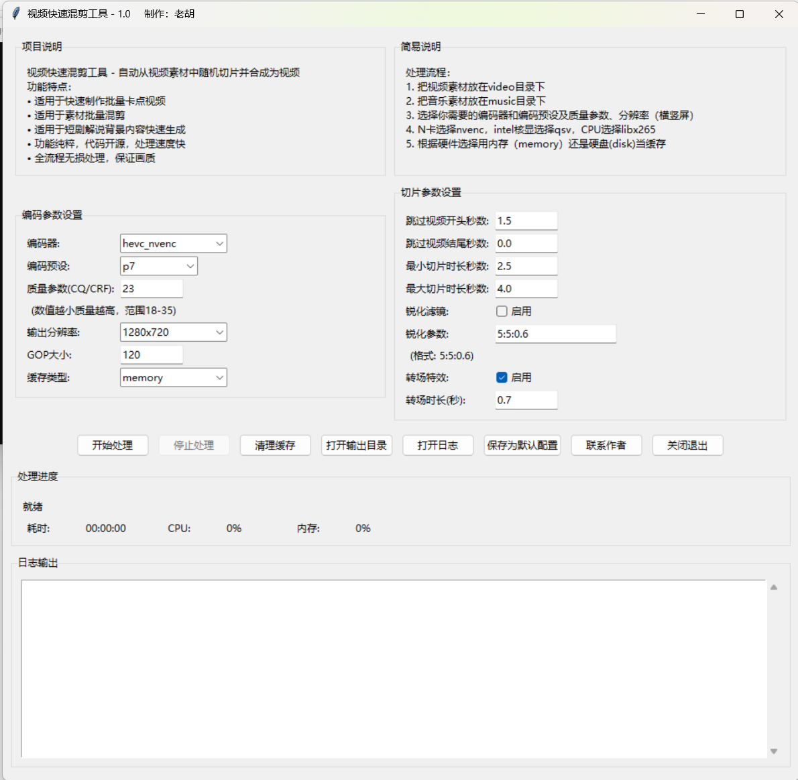

# 视频快速混剪工具

一个基于FFmpeg的视频快速混剪工具，，可以自动将视频切片并合成到MP3音频中。用于快速生成卡点视频、混剪视频。

## 功能特点

- 🎵 自动识别MP3文件并进行视频混剪
- 🎬 支持随机视频切片（可配置时长范围）
- 🔄 支持视频转场效果
- 🎨 GPU加速编码（NVIDIA NVENC 、 intel iHD Graphics）
- ⚙️ 完全通过配置文件控制
- 🚀 批量处理多个MP3文件

## 界面

- 界面截图

## 环境要求

- Python 3.11+（可选）
- FFmpeg

## 使用方法

### 重要

- 确保 FFmpeg 已正确安装并添加到环境变量中。
- 配置文件 `config.ini` 中的参数需要根据实际情况调整。
- 确保 `music/` 目录下有MP3文件，`video/` 目录下有视频文件。
- 确保 `cache/` 目录下有缓存目录（自动生成）。
- 请自行下载最新的ffmpeg放置在bin目录下。
- 如果已经安装了python环境，可以直接运行run_gui.bat文件。会比直接运行makevideo_full.exe快一些。
- 如果没有安装python环境，可以运行makevideo_gui.exe文件，进行设置。
- 也可以用任意文本编辑器修改config.ini文件，进行自定义配置。
- makevideo.exe 是一个简单的命令行工具，会按照默认配置，全自动生成。

### 1. 准备文件结构

```
release/
├── bin/
│   ├── ffmpeg.exe
│   └── ffprobe.exe
├── music/          # 放置MP3文件
├── video/          # 放置视频文件
├── cache/          # 缓存目录（自动生成）
├── output/         # 输出目录（自动生成）
├── log/            # 日志目录（自动生成）
├── config.ini      # 配置文件
└── makevideo_full.exe
```

### 2. 配置参数

编辑 `config.ini` 文件：

```ini
[Default]
# 切片参数
skip_start = 1.5          # 跳过视频开头秒数
skip_end = 0.0            # 跳过视频结尾秒数
min_slice = 2.5           # 最小切片时长(秒)
max_slice = 4.0           # 最大切片时长(秒)

# 编码配置
encoder = hevc_nvenc      # 编码器 (hevc_nvenc 或 h264_nvenc)
preset = p7               # 预设 (p1-p7，p7质量最高)
quality = 26              # 质量 (1-51，越小质量越高)
resolution = 1280x720     # 分辨率
gop = 120                 # GOP大小

# 锐化配置
sharpen = False           # 是否启用锐化
sharpen_params = 5:5:0.6  # 锐化参数

# 转场配置
transition = True         # 是否启用转场
transition_duration = 0.7 # 转场时长(秒)

# 缓存类型
cache_type = disk         # 缓存类型 (disk 或 memory)
```

### 3. 运行程序

直接双击运行 `makevideo_full.exe`，或者在命令行中：

```bash
cd release
.\makevideo_full.exe
```

## 配置说明

### 切片参数

- `skip_start`: 跳过每个视频开头的秒数（避免片头）
- `skip_end`: 跳过每个视频结尾的秒数（避免片尾）
- `min_slice`: 随机切片的最小时长
- `max_slice`: 随机切片的最大时长

### 编码配置

- `encoder`: 使用的编码器
  - `hevc_nvenc`: HEVC编码（H.265），质量更好
  - `h264_nvenc`: H.264编码，兼容性更好
- `preset`: 编码速度/质量预设（p1-p7）
  - p1-p3: 速度快，质量较低
  - p4-p6: 平衡
  - p7: 速度慢，质量最高
- `quality`: 质量参数（CRF值）
  - 18-23: 视觉无损
  - 24-28: 高质量
  - 29-35: 中等质量
- `resolution`: 输出分辨率
- `gop`: 关键帧间隔

### 转场配置

- `transition`: 是否启用视频转场
- `transition_duration`: 转场持续时间

### 缓存类型

- `disk`: 使用磁盘缓存（推荐，稳定）
- `memory`: 使用内存缓存（仅Linux支持，Windows会自动回退到disk）

## 输出文件

处理完成后，视频会保存在 `output/` 目录下，文件名与MP3文件名相同（扩展名为.mp4）。

## 注意事项

1. 确保 `video/` 目录中有足够的视频文件（建议至少100个以上）
2. 视频格式支持 MP4, MKV, AVI 等常见格式
3. ffmpeg版本必须支持NVENC（>=4.3.0）。
4. 如果遇到性能问题，可以降低 `quality` 值或使用 `h264_nvenc`

## 故障排除

### 无法找到MP3文件
检查 `music/` 目录是否放置了MP3文件

### GPU加速不可用
检查：
1. NVIDIA驱动是否最新
2. GPU是否支持NVENC
3. `config.ini` 中的编码器设置是否正确
4. 可以尝试切换indel集显或仅用cpu进行压制。

### 处理速度慢
尝试：
1. 降低 `quality` 值（如28-32）
2. 使用 `h264_nvenc` 而不是 `hevc_nvenc`
3. 减少 `max_slice` 值（切片更短）

## 许可证

MIT License
